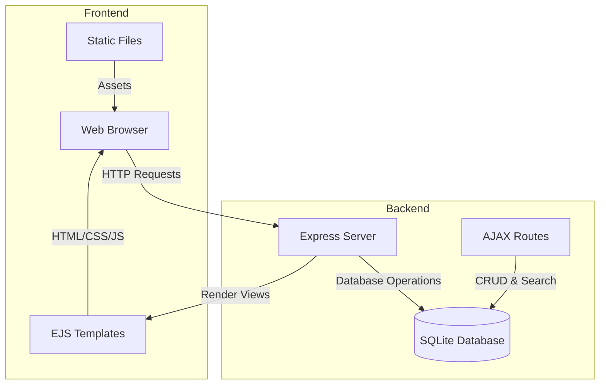
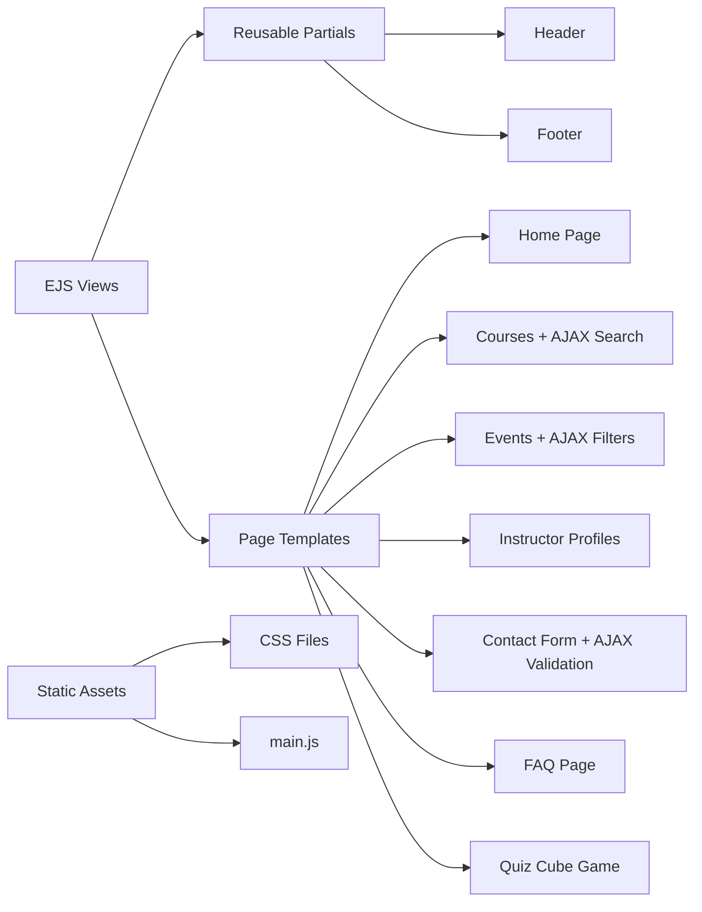
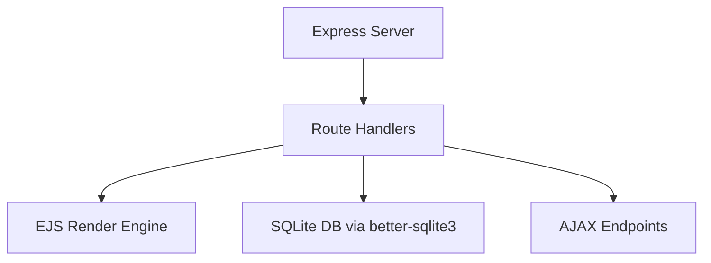
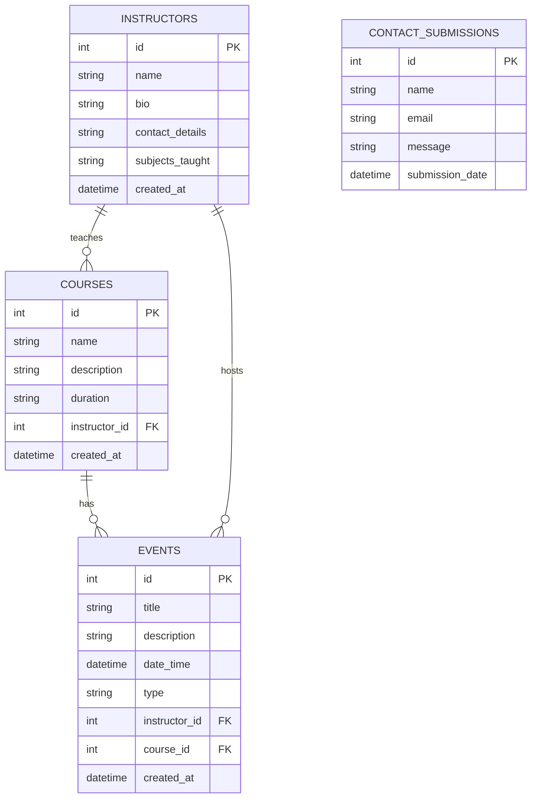

# Technical Documentation: Online Learning Platform

## 📊 System Architecture

## 🏗️ Code Structure

### 1. Frontend Architecture

### 2. Backend Architecture

## 💾 Database Design

## 🔄 AJAX Features & API Flow

### 1. AJAX Contact Form Flow
- User fills form → JS validates input
- Data sent via `fetch('/contact')`
- Server stores data in SQLite → responds with JSON
- Status message appears without reloading the page

### 2. AJAX Event Filters Flow
- User changes filter dropdowns
- JS sends dynamic query to `/events/filter`
- Server queries DB and returns filtered HTML
- Frontend replaces event list with new results

### 3. AJAX Search on Courses Page
- User types in search bar
- JS fetches results from `/courses/search`
- DB filters course titles/descriptions
- Matching courses displayed live

## 🔐 Security Considerations

- Input validation in forms (JS and server-side)
- Prepared statements used to prevent SQL injection
- AJAX responses sanitized
- Contact form uses `required` + length checks

## ♿ Accessibility & Standards

- All pages conform to **W3C validation**
- Clear heading structure (`<h1>`, `<h2>`)
- `aria-label`, `role`, and `aria-live` used in forms and AJAX UI
- All navigation uses semantic elements
- Yellow headings have contrast-enhancing `text-shadow`

## ⚙️ Performance Notes

- Database uses WAL mode for better speed
- Prepared statements optimize queries
- AJAX reduces full page reloads
- Static assets served from `/public`

## 📚 Tools Used

- [Express.js](https://expressjs.com/)
- [EJS](https://ejs.co/)
- [better-sqlite3](https://github.com/WiseLibs/better-sqlite3)
- [DB Browser for SQLite](https://sqlitebrowser.org/)
- [VS Code](https://code.visualstudio.com/)
- Git & GitHub for version control
